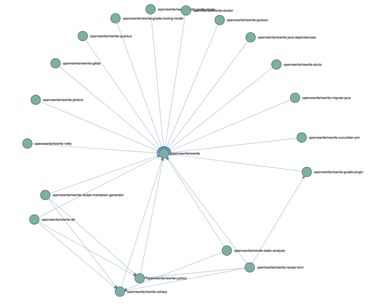

# Release Train Metro Plan

We will analyze relations between OpenRewrite artifacts to understand the release train and see which releases a change implies.
We will use OpenRewrite to query the data and build a visualization on top of it to understand the whole picture.

## Abstract

Teams of Software developers have an allergy relationship to duplicate code for good reasons. Introducing shared libraries is a common medicine in these situations, but like each medicine, shared code has an unintended consequence — it leads to coupling between components and makes release planning mandatory.

By analyzing complex multilayer dependencies between your components, you can extract the necessary information and materialize the Metro plan of your release train. OpenRewrite's DataTable feature makes it easy to extract this information and visualize it. And what's more, with OpenRewrite, these analyses are efficiently scalable for hundreds of connections, making it perfect for complex codebases with many interdependent components.

In this session, I will show you how to utilize DataTable and OpenRewrite recipes to query your code base and gain valuable insights into your release planning process. On top of that, I will reveal the underlying Metro plan of your release train so you can plan your releases more easily in even the most complex scenarios.

## How to use

The usage is ATM somehow manual. 
You run the recipe `org.openrewrite.java.moderne.visualizations.ReleaseTrainMetroPlan` on the codebase's you want to analyze.
If you can use the Moderne CLI it requires less work as it can aggregate the results of multiple runs into one data table.
After we have the data table, similar to [these examples](src/main/kotlin/data), use the [Kotlin Notebook](src/main/kotlin/ArchitecturalAnalysis.ipynb) to analyze the data.
It will connect the dots and create the graph out of it, the resulting JSON data can be used to visualize the graph in a web browser using the [Release Train Metro Plan](src/main/static/metro-plan.html) page.
To update the data just copy the JSON data into the [connections](src/main/static/data/connections.js) file in the static folder.
